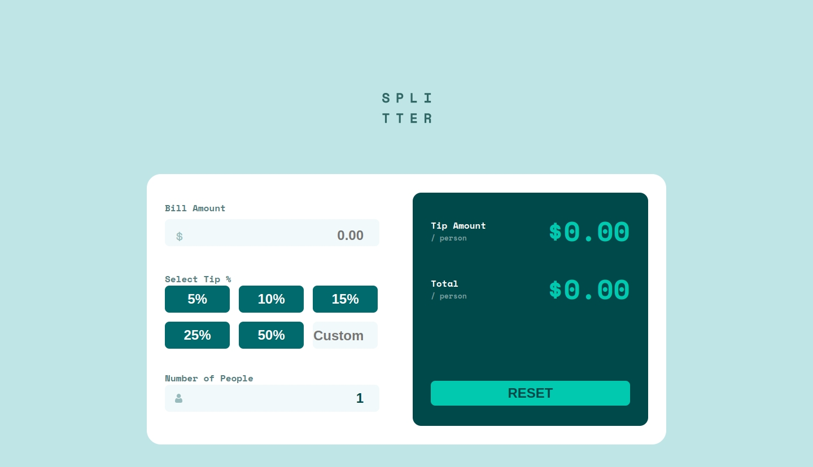

# Frontend Mentor - Tip calculator app solution

This is a solution to the [Tip calculator app challenge on Frontend Mentor](https://www.frontendmentor.io/challenges/tip-calculator-app-ugJNGbJUX). Frontend Mentor challenges help you improve your coding skills by building realistic projects.

## Table of contents

- [Overview](#overview)
  - [The challenge](#the-challenge)
  - [Screenshot](#screenshot)
  - [Links](#links)

  - [Built with](#built-with)
  
- [Author](#author)

## Overview

### The challenge

Users should be able to:

- View the optimal layout for the app depending on their device's screen size
- See hover states for all interactive elements on the page
- Calculate the correct tip and total cost of the bill per person

### Screenshot

### Links

- Solution URL: [https://github.com/CoderAlchemy24/frm-tip-calculator-2.git](https://github.com/CoderAlchemy24/frm-tip-calculator-2.git)
- Live Site URL: [https://bright-concha-adf48d.netlify.app/](https://bright-concha-adf48d.netlify.app/)

### Built with

- [React](https://reactjs.org/) - JS library
- CSS custom properties
- Flexbox
- CSS Grid

## Author

- Website - [CoderAlchemy24](https://github.com/coderalchemy24)
